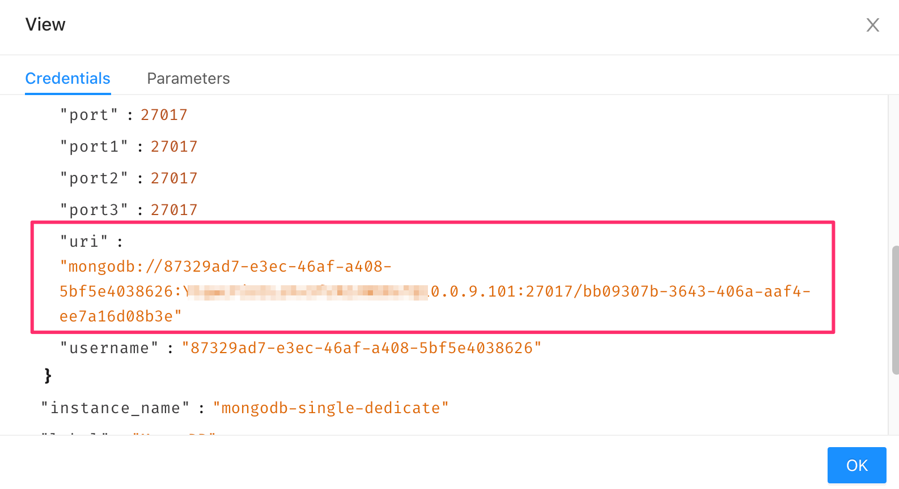
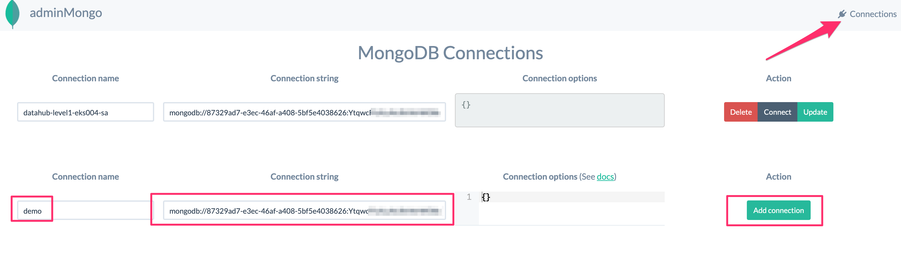

# admin-mongo

This is a ready-to-deploy online MongoDB admin tool for the WISE-PaaS users who did not subscribe to the dedicated MongoDB service and could not remotely access the database.

## Deploying to Your Namespace

### Step 1

```shell
$ git clone git@github.com:WISE-PaaS/admin-mongo.git
$ cd admin-mongo/
$ code .
```

### Step 2

_ingress.yaml_

``host``: {appName}.{namespace}.{clusterName}**.en.internal**

### Step3

```shell
$ kubectl apply -f k8s/
```
<br>

## Using the Tool

Go to the **Service Portal** and select the MongoDB service from the drop-down menu. Find the service instance that you want to connect and click the **Action** icon on the right hand side. Then, click **Secret Management**.


<br>

Find the secret that you want to use. Click the "three-dots" on the right-hand side. Then, click **View**.


<br>

Find the ``uri`` property from the pop-up window. Copy the whole vaule so you can use it as a connection string.



<br>

Enter the external URL of your **adminMongo** deployment into the browser and open the page. If you have not added any connection, you will see the following page. If you do not see this page, click the **Connection** button on the top-right corner to come back to this page anytime. Give the new connection a name, paste the connection string that we just copied from thee **Service Portal**, and then click **Add connection**. 



<br>

Once the connection profile is created, you can click the **Connect** button under **Action** to open a database view. From here, you can select the collection that you want to operate and perform some CRUD operations.


